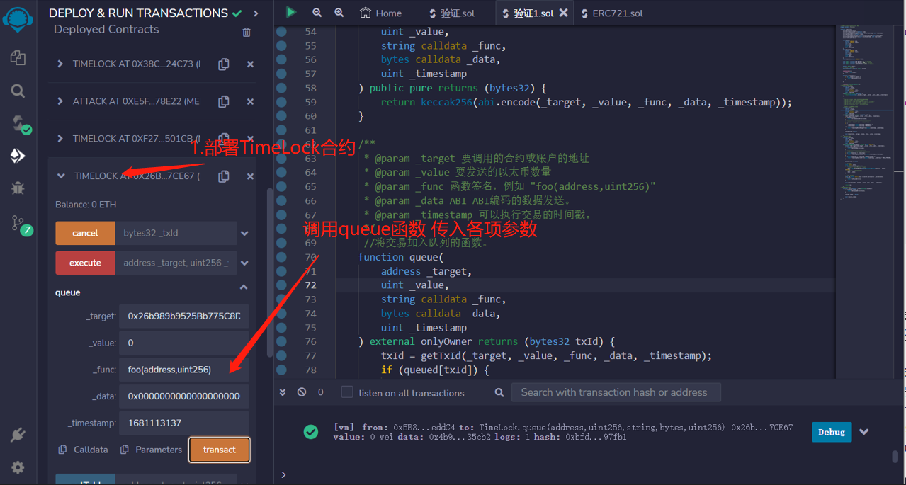
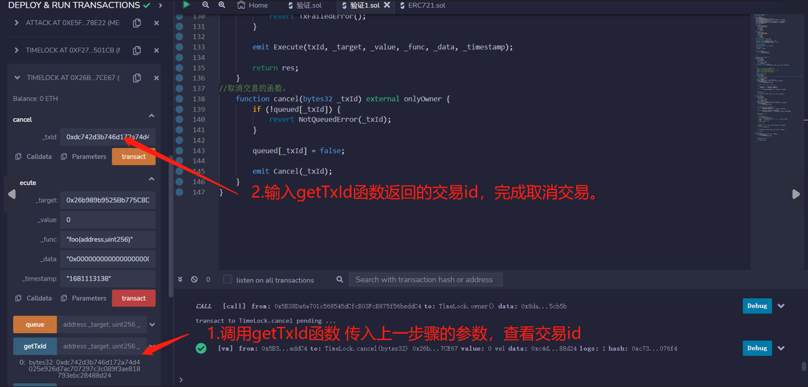

# 65.Time Lock
TimeLock是一个合约，它发布一个将来要执行的交易。在最短等待时间之后，交易就可以执行了。

时间锁常用于 DAO 中。

合约中定义了一些错误类型，用于在合约执行过程中抛出异常。这些错误类型可以帮助合约在执行过程中检测到问题并及时终止程序。
```solidity
    error NotOwnerError();
    error AlreadyQueuedError(bytes32 txId);
    error TimestampNotInRangeError(uint blockTimestamp, uint timestamp);
    error NotQueuedError(bytes32 txId);
    error TimestampNotPassedError(uint blockTimestmap, uint timestamp);
    error TimestampExpiredError(uint blockTimestamp, uint expiresAt);
    error TxFailedError();
```
合约中定义了一些事件，用于在执行交易的过程中发出通知。当合约执行预定交易、执行交易或取消预定交易时，它会相应地发出一个事件，以便其他人可以得知这个操作。
```solidity

    event Queue(
        bytes32 indexed txId,
        address indexed target,
        uint value,
        string func,
        bytes data,
        uint timestamp
    );
    event Execute(
        bytes32 indexed txId,
        address indexed target,
        uint value,
        string func,
        bytes data,
        uint timestamp
    );
    event Cancel(bytes32 indexed txId);
```
合约中定义了一些常量，这些常量用于限制交易的执行时间范围，以及在执行交易时允许的最大延迟时间。这些常量可以帮助合约确保交易的安全性和有效性。
```solidity

    uint public constant MIN_DELAY = 10; // seconds
    uint public constant MAX_DELAY = 1000; // seconds
    uint public constant GRACE_PERIOD = 1000; // seconds

    address public owner;
```
用于存储已经预定的交易。这个映射将交易的 ID 映射到一个布尔值，表示该交易是否已经被预定。这个映射可以帮助合约检测重复交易，以及确保交易的有效性。
```solidity

    // tx id => queued
    mapping(bytes32 => bool) public queued;
```

获取交易ID的函数。
```solidity

function getTxId(
    address _target,
    uint _value,
    string calldata _func,
    bytes calldata _data,
    uint _timestamp
) public pure returns (bytes32) {
    return keccak256(abi.encode(_target, _value, _func, _data, _timestamp));
}

/**
 * @param _target 要调用的合约或账户的地址
 * @param _value 要发送的以太数量
 * @param _func 函数签名，例如 "foo(address,uint256)"
 * @param _data ABI ABI编码的数据发送。
 * @param _timestamp 可以执行交易的时间戳。
 */
//将交易加入队列的函数。
function queue(
    address _target,
    uint _value,
    string calldata _func,
    bytes calldata _data,
    uint _timestamp
) external onlyOwner returns (bytes32 txId) {
    txId = getTxId(_target, _value, _func, _data, _timestamp);
    if (queued[txId]) {
    revert AlreadyQueuedError(txId);
    }
    // ---|------------|---------------|-------
    //  block    block + min     block + max
    if (
        _timestamp < block.timestamp + MIN_DELAY ||
        _timestamp > block.timestamp + MAX_DELAY
    ) {
        revert TimestampNotInRangeError(block.timestamp, _timestamp);
    }

    queued[txId] = true;

    emit Queue(txId, _target, _value, _func, _data, _timestamp);
}
//执行交易的函数。
function execute(
    address _target,
    uint _value,
    string calldata _func,
    bytes calldata _data,
    uint _timestamp
) external payable onlyOwner returns (bytes memory) {
    bytes32 txId = getTxId(_target, _value, _func, _data, _timestamp);
    if (!queued[txId]) {
        revert NotQueuedError(txId);
    }
    // ----|-------------------|-------
    //  timestamp    timestamp + grace period
    if (block.timestamp < _timestamp) {
        revert TimestampNotPassedError(block.timestamp, _timestamp);
    }
    if (block.timestamp > _timestamp + GRACE_PERIOD) {
        revert TimestampExpiredError(block.timestamp, _timestamp + GRACE_PERIOD);
    }

    queued[txId] = false;

    // 准备数据
    bytes memory data;
    if (bytes(_func).length > 0) {
        // data = func selector + _data
        data = abi.encodePacked(bytes4(keccak256(bytes(_func))), _data);
    } else {
        //调用回退函数并附带数据
        data = _data;
    }

    // 调用目标
    (bool ok, bytes memory res) = _target.call{value: _value}(data);
    if (!ok) {
        revert TxFailedError();
    }

    emit Execute(txId, _target, _value, _func, _data, _timestamp);

    return res;
}
//取消交易的函数。
function cancel(bytes32 _txId) external onlyOwner {
    if (!queued[_txId]) {
        revert NotQueuedError(_txId);
    }

    queued[_txId] = false;

    emit Cancel(_txId);
}
```


## remix验证
1. 部署TimeLock合约，调用queue函数 传入参数
* _target：验证中因为调用的是Timelock自己的函数，填入合约地址。
* _value：不用转入ETH，这里填0。
* _func：函数签名，例如 "foo(address,uint256)"。
* _data：这里填要传入的参数，也就是新管理员的地址。但是要把地址填充为32字节的数据，以满足以太坊ABI编码标准。可以使用hashex网站进行参数的ABI编码。例子：
    * 编码前地址：0xAb8483F64d9C6d1EcF9b849Ae677dD3315835cb2
    * 编码后地址：0x000000000000000000000000ab8483f64d9c6d1ecf9b849ae677dd3315835cb2
* _timestamp：可以执行交易的时间戳。

1. 调用getTxId函数 传入上一步的参数，查看交易id；再调用cancel函数 ，输入getTxId函数返回的交易id，完成取消交易。
