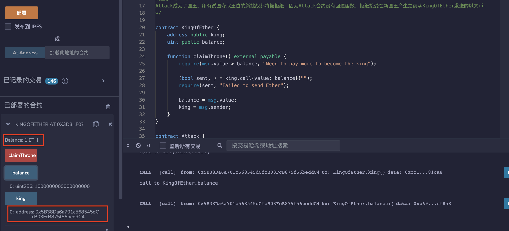
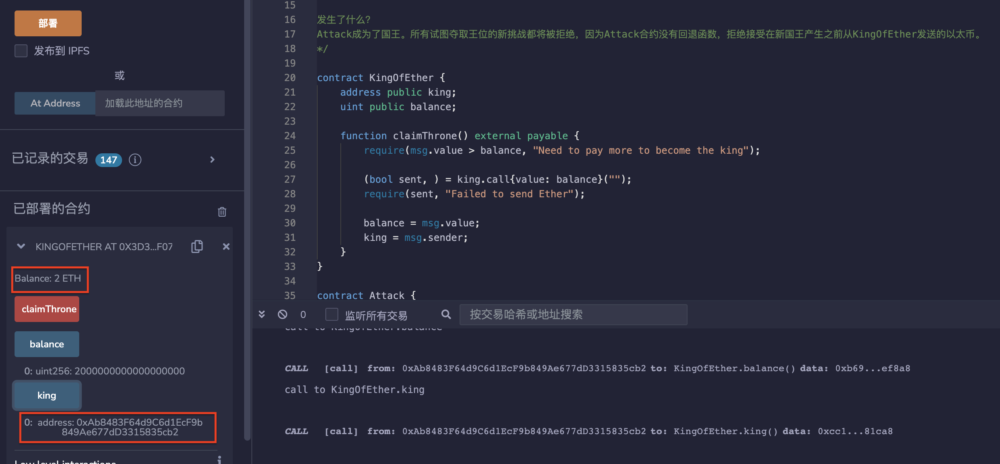
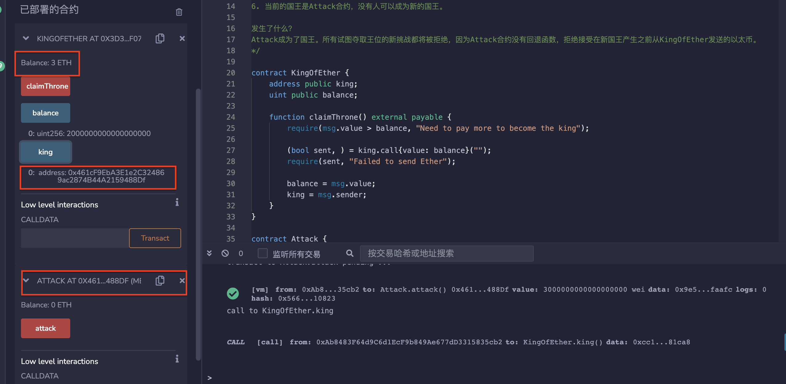

# 72.Denial of Service
Solidity的Denial of Service (DoS)攻击是一种恶意行为，旨在通过消耗大量资源来阻止合约的正常运行。攻击者可以通过多种方式实现DoS攻击，包括：
* 无限循环：攻击者可以编写一个无限循环的代码，使合约陷入死循环，从而消耗大量的计算资源。
* 大量输入：攻击者可以向合约发送大量的输入数据，使合约无法处理所有的请求，从而导致拒绝服务。
* 阻塞调用：攻击者可以利用阻塞调用的漏洞，使合约陷入阻塞状态，从而无法继续执行其他操作。
## 漏洞
攻击智能合约使其无法使用的方法有很多种。
我们在这里介绍的一种利用是通过让发送以太的函数失败来实现拒绝服务。
以太坊智能合约通常包含发送以太的函数，这些函数允许用户将以太转移到其他地址。攻击者可以利用漏洞或故意构造恶意输入来使这些函数失败，从而阻止其他用户发送以太或执行其他操作。
## KingOfEther
KingOfEther的目标是通过发送比前任国王更多的以太来成为国王。前任国王将获得他发送的以太的退款。
```solidity
contract KingOfEther {
    address public king;
    uint public balance;

    function claimThrone() external payable {
        require(msg.value > balance, "Need to pay more to become the king");

        (bool sent, ) = king.call{value: balance}("");
        require(sent, "Failed to send Ether");

        balance = msg.value;
        king = msg.sender;
    }
}
```
## 攻击合约Attack
1. 部署KingOfEther。
2. Alice通过发送1 以太来调用claimThrone()函数成为了国王。
3. Bob通过发送2 以太来调用claimThrone()函数成为了国王。Alice收到了1 以太的退款。
4. 部署Attack合约并将KingOfEther的地址作为参数。
5. 调用attack函数并发送3 以太。
6. 当前的国王是Attack合约，没有人可以成为新的国王。

发生了什么？
Attack成为了国王。所有试图夺取王位的新挑战都将被拒绝，因为Attack合约没有回退函数，拒绝接受在新国王产生之前从KingOfEther发送的以太。
```solidity
contract Attack {
    KingOfEther kingOfEther;

    constructor(KingOfEther _kingOfEther) {
        kingOfEther = KingOfEther(_kingOfEther);
    }

    function attack() public payable {
        kingOfEther.claimThrone{value: msg.value}();
    }
}
```
你还可以通过使用assert消耗所有的gas来执行DOS攻击。
即使调用合约没有检查调用是否成功，此攻击也会起作用。
```solidity
    function () external payable {
        assert(false);
    }
```
## 预防性技术
防止这种情况的一种方法是允许用户撤回他们的以太而不是发送它。
以下是一个例子。
```solidity
// SPDX-License-Identifier: MIT
pragma solidity ^0.8.17;

contract KingOfEther {
    address public king;
    uint public balance;
    mapping(address => uint) public balances;

    function claimThrone() external payable {
        require(msg.value > balance, "Need to pay more to become the king");

        balances[king] += balance;

        balance = msg.value;
        king = msg.sender;
    }

    function withdraw() public {
        require(msg.sender != king, "Current king cannot withdraw");

        uint amount = balances[msg.sender];
        balances[msg.sender] = 0;

        (bool sent, ) = msg.sender.call{value: amount}("");
        require(sent, "Failed to send Ether");
    }
}
```

## remix验证
部署合约KingOfEther，1地址通过发送1 以太来调用claimThrone()函数成为了国王。

2地址通过发送2 以太来调用claimThrone()函数成为了国王。1地址收到了1 以太的退款。

部署Attack合约并将KingOfEther的地址作为参数。调用attack函数并发送3 以太。当前的国王是Attack合约。

