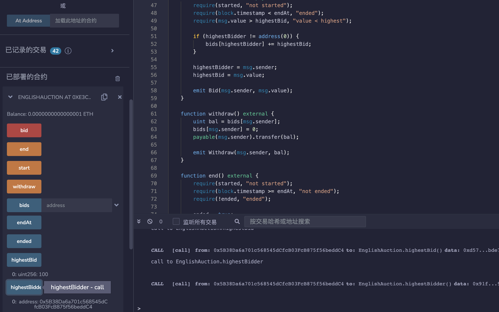

# 74.Hiding Malicious Code with External Contract
## 漏洞
在Solidity中，任何地址都可以强制转换为特定的合约，即使该地址上的合约并不是被强制转换的合约。
在以太坊智能合约中，恶意代码可以通过引入外部合约进行隐藏。外部合约是指在智能合约中引入并调用的其他合约。恶意代码可以被放置在外部合约中，然后在主合约中调用该外部合约，从而避免被直接检测到。
这种技术被称为“合约委托”，它可以使恶意代码更难被发现，因为它们被隐藏在调用的外部合约中。此外，由于外部合约可以被多个主合约调用，因此恶意代码也可以在多个合约中重复利用。
这可以被利用来隐藏恶意代码。让我们看看如何实现。

## 漏洞例子
假设Alice可以看到Foo和Bar的代码，但看不到Mal的代码。
对于Alice来说，Foo.callBar()执行的是Bar.log()中的代码是显而易见的。
然而，Eve使用Mal的地址部署Foo，这样调用Foo.callBar()实际上会执行Mal中的代码。

1. Eve部署了Mal。
2. Eve部署了Foo，并使用Mal的地址。
3. Alice阅读代码后判断可以安全地调用Foo.callBar()。
4.尽管Alice期望执行Bar.log()，但实际执行的是Mal.log()。
```solidity
// SPDX-License-Identifier: MIT
pragma solidity ^0.8.17;

contract Foo {
    Bar bar;

    constructor(address _bar) {
        bar = Bar(_bar);
    }

    function callBar() public {
        bar.log();
    }
}

contract Bar {
    event Log(string message);

    function log() public {
        emit Log("Bar was called");
    }
}

// 这段代码被隐藏在一个单独的文件中。
contract Mal {
    event Log(string message);

    // function () external {
    //     emit Log("Mal was called");
    // }

    // 实际上，即使这个函数不存在，我们仍然可以使用回退方式执行相同的攻击。
    function log() public {
        emit Log("Mal was called");
    }
}
```

## 预防性技术
* 在构造函数中初始化新合约
* 将外部合约地址公开，以便外部合约的代码可以被审查。
* 为了防止这种攻击，开发者需要审查和验证所有引入的外部合约，并确保它们不包含任何恶意代码。此外，还可以使用工具和技术来检测和防范此类攻击，例如静态代码分析和安全审计。
```solidity
Bar public bar;

constructor() public {
    bar = new Bar();
}
```

## remix验证
部署合约Mal，部署合约Foo，并使用Mal的地址，调用Foo.callBar()，执行的是Mal.log()。

