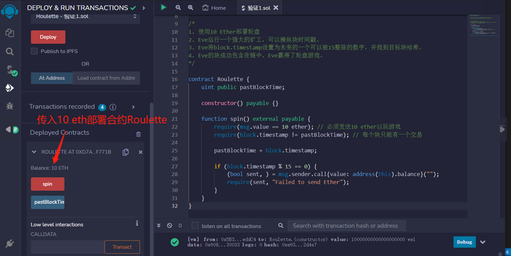
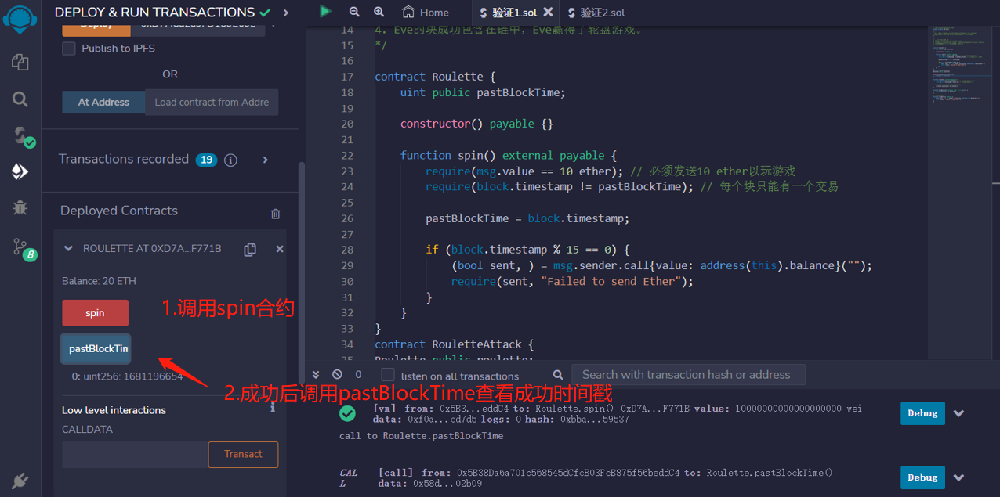

# 77.Block Timestamp Manipulation
## 漏洞
矿工可以通过以下限制来操纵block.timestamp：
* 它不能比其父块早
* 它不能太遥远的未来


轮盘是一种游戏，您可以在特定时间提交交易以赢取合同中的所有以太。
玩家需要发送10 Ether，如果block.timestamp％15 == 0，则赢了。

1. 使用10 Ether部署轮盘
2. Eve运行一个强大的矿工，可以操纵块时间戳。
3. Eve将block.timestamp设置为未来的一个可以被15整除的数字，并找到目标块哈希。
4. Eve的块成功包含在链中，Eve赢得了轮盘游戏。


```solidity
// SPDX-License-Identifier: MIT
pragma solidity ^0.8.17;
contract Roulette {
    uint public pastBlockTime;

    constructor() payable {}

    function spin() external payable {
        require(msg.value == 10 ether); // 必须发送10 ether以玩游戏
        require(block.timestamp != pastBlockTime); // 每个块只能有一个交易

        pastBlockTime = block.timestamp;

        if (block.timestamp % 15 == 0) {
            (bool sent, ) = msg.sender.call{value: address(this).balance}("");
            require(sent, "Failed to send Ether");
        }
    }
}
```
## 预防技术
不要使用block.timestamp作为熵和随机数的来源。

## remix验证
1. 传入10 eth部署合约Roulette

2. 调用spin合约，成功后调用pastBlockTime查看成功时间戳
