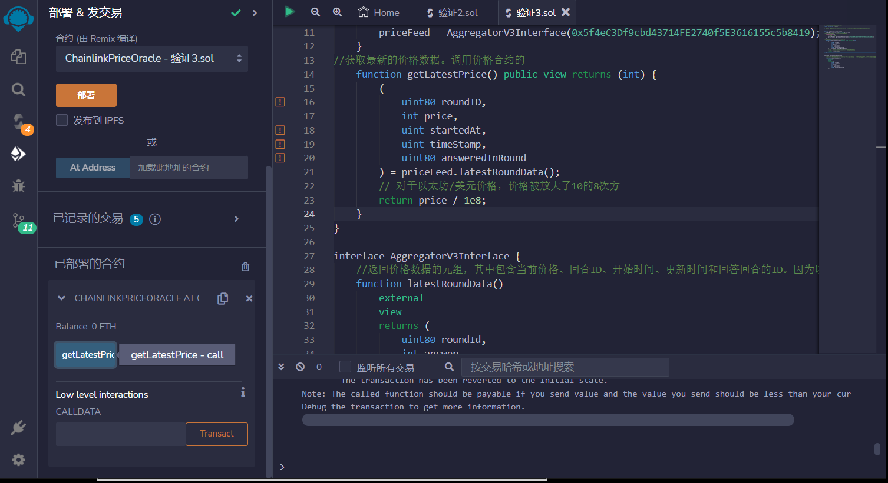

# 89.Chainlink Price Oracle
## 以太坊/美元价格预言机


在合约构造函数中，使用给定的地址初始化了 priceFeed 变量。该地址指向Chainlink的价格预言机合约，该合约提供了以太坊/美元的价格数据。
```solidity
constructor() {
    // ETH / USD
    priceFeed = AggregatorV3Interface(0x5f4eC3Df9cbd43714FE2740f5E3616155c5b8419);
}
```
getLatestPrice 函数是公共的视图函数，用于获取最新的以太坊/美元价格数据。它调用了 priceFeed 变量的 latestRoundData 函数，并将返回的价格除以10的8次方，以得到正确的价格。
```solidity
function getLatestPrice() public view returns (int) {
    (
        uint80 roundID,
        int price,
        uint startedAt,
        uint timeStamp,
        uint80 answeredInRound
    ) = priceFeed.latestRoundData();
    // 对于EYH/美元价格，价格被放大了10的8次方
    return price / 1e8;
}
```
返回价格数据的元组，其中包含当前价格、回合ID、开始时间、更新时间和回答回合的ID。因为以太坊/美元价格被放大了10的8次方，所以需要将价格除以1e8。
```solidity
interface AggregatorV3Interface {
    function latestRoundData()
        external
        view
        returns (
            uint80 roundId,
            int answer,
            uint startedAt,
            uint updatedAt,
            uint80 answeredInRound
        );
}
```

## remix验证
1. 部署ChainlinkPriceOracle合约
